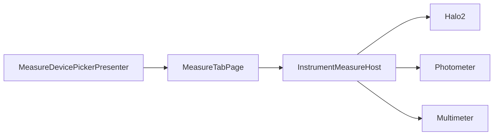

# Hanna Lab UI Demo — Modular architecture

## Design principle: one enum, three vertical slices

Every instrument family shares **`InstrumentKind`** (`Core/Devices/InstrumentKind.cs`) across:

- Devices (connection list)
- Measure tab (live UI plugins)
- Log History tab (aggregated catalogs + family navigators)

Each family is a **module** under `Features/Instruments/{Family}/` with its own measure UI, settings, and log data.

## Folder layout

```
Core/Devices/
  InstrumentKind.cs           # Photometer | Multimeter | Halo2
  InstrumentRegistry.cs       # Picker labels, nav titles
  InstrumentModuleRegistry.cs # Feature flags per family
  DeviceIconResolver.cs

Features/Measure/             # Device-agnostic tab host only
  MeasureTabPage.cs           # Shows one IInstrumentMeasureModule at a time
  MeasureTabViewModel.cs
  MeasureDevicePickerPresenter.cs

Features/Instruments/
  Abstractions/
    IInstrumentLogContributor.cs   # Demo log data per family
    IInstrumentLogNavigator.cs     # Log detail navigation per family
  IInstrumentMeasureModule.cs      # Measure tab plugin contract
  InstrumentMeasureHost.cs
  InstrumentLogNavigatorHost.cs

  Halo2/
    Halo2MeasureModule.cs
    Halo2MeasureView.cs
    Halo2SettingsPage.cs
    Halo2CalibrationPage.cs
    Logs/  → Halo2LogCatalog, Halo2LogContributor, Halo2LogNavigator, Halo2LogDetailPage

  Photometer/
    PhotometerMeasureModule.cs
    MeasurePhotometerView.xaml
    PhotometerShellNavigation.cs
    Logs/  → PhotometerLogCatalog, PhotometerLogContributor, PhotometerLogNavigator, tank pages

  Multimeter/
    MultimeterMeasureModule.cs      # On-device LOT/LOD recall (Measure tab)
    MultimeterLogRecallView.xaml
    Logs/  → MultimeterLogCatalog, MultimeterLogContributor, MultimeterLogNavigator

  Logs/                             # Shared Log History shell
    LogsTabPage.xaml
    LogHistoryCatalog.cs            # Aggregates IInstrumentLogContributor
    LogHistoryDeviceLogsViewModel.cs
```

## Plugin contracts

| Contract | Host | Implementations |
|----------|------|-----------------|
| `IInstrumentMeasureModule` | `InstrumentMeasureHost` | `Halo2MeasureModule`, `PhotometerMeasureModule`, `MultimeterMeasureModule` |
| `IInstrumentLogContributor` | `LogHistoryCatalog.Rebuild()` | `Halo2LogContributor`, `PhotometerLogContributor`, `MultimeterLogContributor` |
| `IInstrumentLogNavigator` | `InstrumentLogNavigatorHost` | `Halo2LogNavigator`, `PhotometerLogNavigator`, `MultimeterLogNavigator` |

## Measure tab flow



`MeasureTabPage` hides all module views, then shows `module.Content` for the selected `InstrumentKind`. Photometer shell chrome is handled inside `PhotometerShellNavigation`, not in the tab host.

## Log History flow

1. **Home** — three cards (one per `InstrumentKind`)
2. **Device list** — `LogHistoryDeviceLogsViewModel` filtered by kind
3. **Detail** — `InstrumentLogNavigatorHost.Get(kind)` opens Halo detail, photometer tank readings, or multimeter placeholder

## MVVM and DI

- CommunityToolkit.Mvvm: `[ObservableProperty]`, `[RelayCommand]`
- `AddHannaViewModels()` → `AddInstrumentModules()` registers hosts, modules, navigators, contributors
- `AppServices.Get<T>()` for Shell tab pages created from XAML

## Adding a new instrument family

1. Add value to `InstrumentKind` and entry in `InstrumentRegistry` + `InstrumentModuleRegistry`
2. Create `Features/Instruments/{NewFamily}/` with `*MeasureModule`, optional settings/calibration
3. Implement `IInstrumentLogContributor` + `IInstrumentLogNavigator` under `{NewFamily}/Logs/`
4. Register types in `InstrumentServiceCollectionExtensions.AddInstrumentModules()`
5. Append contributor to `LogHistoryCatalog.Contributors` (or resolve contributors from DI)

## Production migration

Replace static catalogs (`*LogCatalog`, `DemoDeviceCatalog`) with `IDeviceRepository` and cloud sync services. Keep the same module interfaces so UI slices stay isolated per instrument type.
